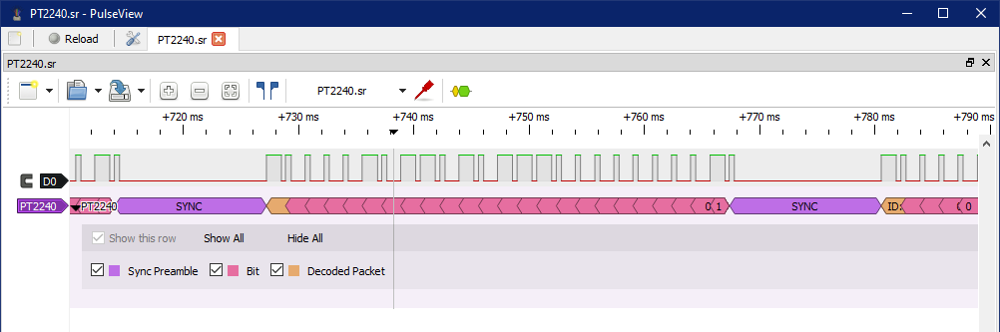

# sigrok-pt2240

A protocol decoder for **sigrok / PulseView** that decodes **PT2240 / PT2240P** ASK/OOK wireless remote control signals. 

The PT2240 is a popular 24-bit RF encoder chip widely used in 433MHz/315MHz wireless key fobs, garage door openers, and security sensors. This decoder maps out the synchronous preamble, extracts individual data bits, and parses the 20-bit Remote ID alongside the 4-bit Data payload.



## Hardware Protocol & Timings

This decoder is calibrated based on verified hardware captures of a **PT2240P-D3S** transmitter running at standard operating parameters. The timing characteristics utilize a **4:1 PWM duty cycle ratio**:

* **Bit Duration:** ~1.6 ms
* **Sync Preamble:** ~12.7 ms total gap (~0.4 ms HIGH followed by ~12.3 ms LOW)
* **Logic '0':** ~400 µs HIGH / ~1200 µs LOW
* **Logic '1':** ~1200 µs HIGH / ~400 µs LOW

*Note: Because hardware resistor oscillators ($R_{osc}$) can drift due to temperature or battery voltage drops, the decoder includes generous timing gates to maximize capture reliability.*

## Packet Breakdown

Each complete transmission frame consists of **24 bits** parsed on the falling edges following a valid Sync preamble:
1. **ID Bits (20 bits):** The unique address assigned to the transmitter chip.
2. **Data Bits (4 bits):** Reflects the physical button states or sensor triggers (often mapped to pins D0-D3 on the IC).

Output format displayed in PulseView:  
`ID: 0xXXXXX | Data: 0xX`

## Installation

To install this decoder locally in PulseView/sigrok, clone this repository directly into your local user decoders directory:

### Linux / macOS
```bash
git clone https://github.com/YOUR_USERNAME/sigrok-pt2240.git ~/.local/share/libsigrokdecode/decoders/pt2240
```

### Windows
Clone or extract the repository folder into:
```text
%APPDATA%\pulseview\decoders\pt2240
```
*(Or `%APPDATA%\sigrok-cli\decoders\pt2240` depending on your sigrok installation setup).*

**Important:** The target folder name **must** be exactly `pt2240` so PulseView can successfully map the internal module references. Restart PulseView after copying the files.

## License

This project is licensed under the **GPL-3.0-or-later** license — the same license utilized by the core `libsigrokdecode` ecosystem. See the `LICENSE` file for details.

## Credits

Developed in collaboration with Gemini (Google AI), utilizing real-world signal timings and hardware verification.
